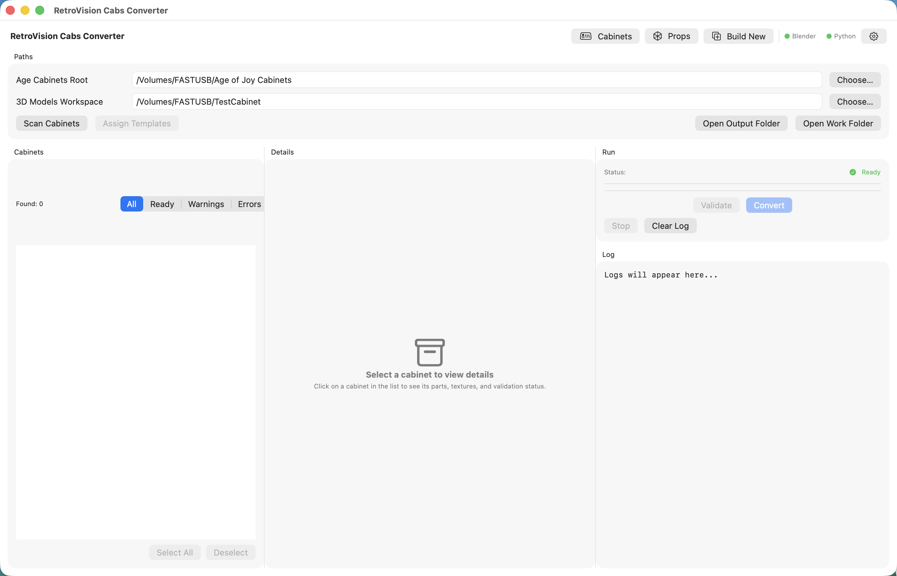
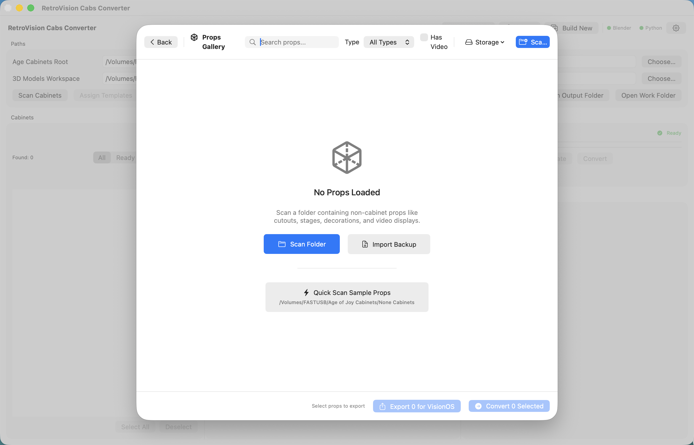
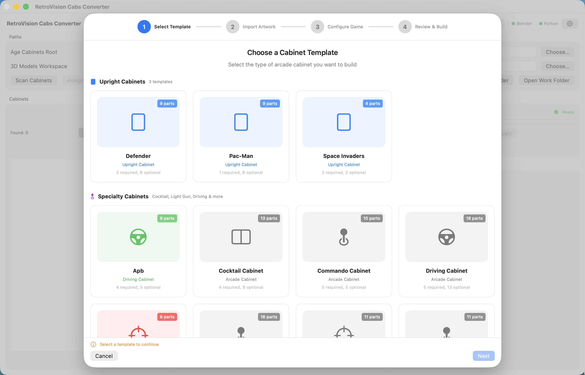

<p align="center">
  
  
  
  
  
</p>

<h1 align="center">🕹️ RetroVision Cabs Converter</h1>

<p align="center">
  <strong>Transform retro arcade cabinets into stunning VisionOS experiences</strong>
</p>

<p align="center">
  Convert GLB arcade cabinet models to USDZ format with full interactivity,<br>
  video playback, LED animations, and generated Swift code for Apple Vision Pro.
</p>

<p align="center">
  <a href="https://buymeacoffee.com/britx">
    
  </a>
</p>

---

## ✨ Features

### 🎮 Cabinet Conversion
- **GLB to USDZ** — Convert 3D cabinet models using Blender automation
- **Texture Mapping** — Automatic material and texture application from YAML configs
- **Video Integration** — Convert and embed gameplay videos (HEVC/H.264/ProRes)
- **Audio Support** — Include cabinet sounds and ambient audio

### 🥽 VisionOS Export
- **Interactive Swift Code** — Generated SwiftUI views with full interactivity
- **Drag, Rotate, Scale** — Gesture handlers for immersive manipulation
- **Video Playback** — AVPlayer integration for cabinet screens
- **CRT Shader Effects** — Metal shaders for authentic retro display looks
- **LED Animations** — Animated cabinet lighting effects

### 🖼️ Props Gallery
- **Stage Props** — Disco stages, cutouts, decorations
- **Wall Art** — Posters, signs, themed decorations
- **Batch Export** — Convert multiple props at once

### 🛠️ Build Wizard
- **Template Selection** — Upright, cocktail, driving cabinet templates
- **Artwork Import** — Side art, marquee, bezel, control panel
- **Preview Generation** — 3D previews before conversion

---

## 📸 Screenshots

### Cabinet Gallery
<p align="center">
  
</p>
<p align="center"><em>Scan, preview, and convert arcade cabinet packs to VisionOS-ready USDZ format</em></p>

### Props Gallery
<p align="center">
  
</p>
<p align="center"><em>Manage and convert props like stages, cutouts, and decorations</em></p>

### Build Wizard
<p align="center">
  
</p>
<p align="center"><em>Create custom cabinets from templates — Upright, Cocktail, Driving & more</em></p>

---

## 🚀 Quick Start

### Download

📦 **[Download RetroVisionCabsConverter-3.0.dmg](https://github.com/britxpatusa/RetroVisionCabsConverter/releases/latest)**

### Requirements

| Requirement | Version |
|-------------|---------|
| macOS | 14.0 (Sonoma) or later |
| Blender | 3.0 or later |
| FFmpeg | 4.0 or later |
| Python | 3.9 or later |

### Installation

1. **Download** the DMG from [Releases](https://github.com/britxpatusa/RetroVisionCabsConverter/releases)
2. **Open** the DMG and drag the app to Applications
3. **Launch** RetroVisionCabsConverter
4. **Install dependencies** when prompted:
   ```bash
   # Install Blender from blender.org
   
   # Install FFmpeg via Homebrew
   brew install ffmpeg
   ```

---

## 🎯 Usage

### Converting Cabinets

1. **Open Cabinet Gallery** from the toolbar
2. **Scan** your Age of Joy cabinets folder
3. **Select** cabinets to convert
4. **Click "Export for VisionOS"**
5. **Configure** video codec, quality, and options
6. **Export!**

### Using in VisionOS

The exported folder contains:

```
CabinetName/
├── CabinetName.usdz          # 3D model
├── cabinet_config.json       # Metadata
├── CabinetNameView.swift     # Interactive SwiftUI view
├── CRTEffect.metal           # CRT shader (optional)
├── Textures/                 # Texture files
├── Video/                    # Converted video
└── README.md                 # Integration guide
```

**Add to your VisionOS project:**

```swift
import SwiftUI
import RealityKit

struct ContentView: View {
    var body: some View {
        CabinetPacManView()  // Generated interactive view
    }
}
```

---

## 🎨 Supported Formats

### Input
| Type | Formats |
|------|---------|
| 3D Models | `.glb`, `.gltf` |
| Images | `.png`, `.jpg`, `.tga` |
| Video | `.mp4`, `.mkv`, `.mov`, `.avi` |
| Audio | `.mp3`, `.wav`, `.m4a` |
| Config | `.yaml`, `.json` |

### Output
| Type | Formats |
|------|---------|
| 3D Models | `.usdz` (SceneKit/RealityKit) |
| Video | `.mp4` (HEVC/H.264/ProRes) |
| Code | `.swift` (SwiftUI/RealityKit) |
| Shaders | `.metal` (CRT effects) |

---

## 🛡️ Privacy

RetroVision Cabs Converter respects your privacy:

- ✅ **No data collection** — Everything stays on your Mac
- ✅ **No analytics** — No tracking or telemetry
- ✅ **No network required** — Works completely offline
- ✅ **No account needed** — Just download and use

See [PRIVACY_POLICY.md](PRIVACY_POLICY.md) for details.

---

## 🔧 Building from Source

```bash
# Clone the repository
git clone https://github.com/britxpatusa/RetroVisionCabsConverter.git
cd RetroVisionCabsConverter

# Open in Xcode
open RetroVisionCabsConverter.xcodeproj

# Build and run (⌘R)
```

### Build for Distribution

```bash
# Set up credentials (first time only)
xcrun notarytool store-credentials "AC_PASSWORD" \
    --apple-id "your@email.com" \
    --team-id "YOUR_TEAM_ID"

# Build, sign, notarize, and create DMG
./Scripts/build-release.sh
```

---

## 📖 Documentation

| Document | Description |
|----------|-------------|
| [VisionOS Integration Guide](VisionOS_Integration_Guide.md) | How to use exported assets |
| [Distribution Options](DISTRIBUTION_OPTIONS.md) | App Store vs Developer ID |
| [Release Guide](RELEASE.md) | How to build releases |
| [Test Checklist](TEST_CHECKLIST.md) | QA testing guide |
| [Privacy Policy](PRIVACY_POLICY.md) | Privacy information |

---

## 🤝 Contributing

Contributions are welcome! Please read our **[Contributing Guide](CONTRIBUTING.md)** before submitting changes.

**Quick Start:**
1. Fork the repository
2. Create a feature branch (`git checkout -b feature/amazing`)
3. Make your changes and test thoroughly
4. Submit a Pull Request

Please review our [Code of Conduct](CODE_OF_CONDUCT.md) and [Security Policy](SECURITY.md).

---

## 📄 License

This project is licensed under the MIT License - see the [LICENSE](LICENSE) file for details.

---

## 🙏 Acknowledgments

- **Age of Joy** — For the amazing arcade cabinet format
- **Blender** — For 3D model processing
- **FFmpeg** — For video conversion
- **Apple** — For VisionOS and RealityKit

---

<p align="center">
  Made with ❤️ for the retro gaming community
</p>

<p align="center">
  <a href="https://github.com/britxpatusa/RetroVisionCabsConverter/issues">Report Bug</a>
  ·
  <a href="https://github.com/britxpatusa/RetroVisionCabsConverter/issues">Request Feature</a>
  ·
  <a href="https://github.com/britxpatusa/RetroVisionCabsConverter/releases">Download</a>
</p>

---

<p align="center">
  <sub>Last updated: February 2026 • Version 3.0</sub>
</p>
